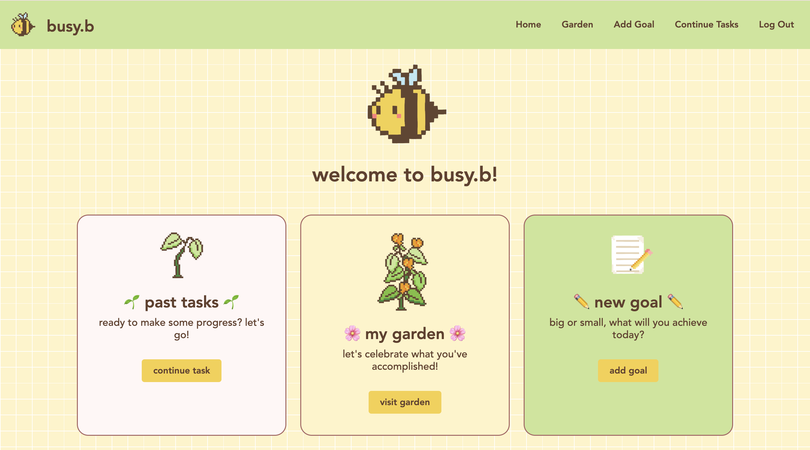

# 🐝 busy.b: 
## A Plant-Lover's Productivity Tracker

### Link: https://youtu.be/CJe45e0EMPI

## 🌸 Description
busy.b is a productivity tracker that makes completing goals and mini subtasks fun and easy, with a gamified, plant-themed twist! Add 3-part goals, complete subtasks, and watch your progress unfold through different stages of plant growth in your personal garden! 

This app was developed using VisualStudioCode, built in Python 3 using the Flask framework, SQLite3 to manage the database, and HTML/CSS for the UI.

All pixel artwork was hand-drawn in Adobe Fresco, to create a simple yet stylized interface. I prioritized simplicity and cohesiveness throughout the product, so that the main focus could be on the user's goal-tracking rather than distracting visuals.

## 🌱 Usage

### Account Information
Users first need to sign up, with new usernames and hashed passwords stored in a secure SQLite3 database. The log out button in the navigation bar redirects users to the login page, clearing current data and allowing for multiple users to access busy.b on the same device.

### Home Page
The home page connects to all the other pages (add goal, continue tasks, and view garden) through both the navigation bar and the main content.

### Add Goal
busy.b functions as a microproductivity tracker, breaking down large goals into smaller subtasks. Users start by drafting their goals, then they are prompted to split their goal into up to three subtasks. If no goal is entered, the user encounters an error and is redirected.

### Continue Tasks
Tasks from added goals are tracked and completed through tables, listed in order from newest to oldest. As each subtask is completed, a digital plant "grows" from a seed to a sprout to a blooming plant, validating the user's progress. 

Updates are synchronized in real-time with the garden page, so users can return to partially-completed tasks at a later time.

### View Garden
The garden is a visual indicator of the user's progress, including every previously logged goal and subtask. Final flower colors are generated randomly, for a new surprise each time, but progress is indicated by the plant height and stage.

Special effects such as rain are also available, to enhance the app's gamified style.

### Errors
Errors route through apology.html page, with a short description of the issue at hand.

## ✏️ Dependencies
The app relies on: cs50, Flask, Flask-Session. These are listed in requirements.txt for easy installation.

To install, download and unzip the project folder. Ensure **Python 3.10+** is installed. Install dependencies in requirements.txt, and run the app using `flask run --debug` or `python app.py`.

Then, open browser and navigate to http://127.0.0.1:5000/.

## Authors
Victoria Chen 
Github: @daisies-dots
Last Edited: 07/24/2026
